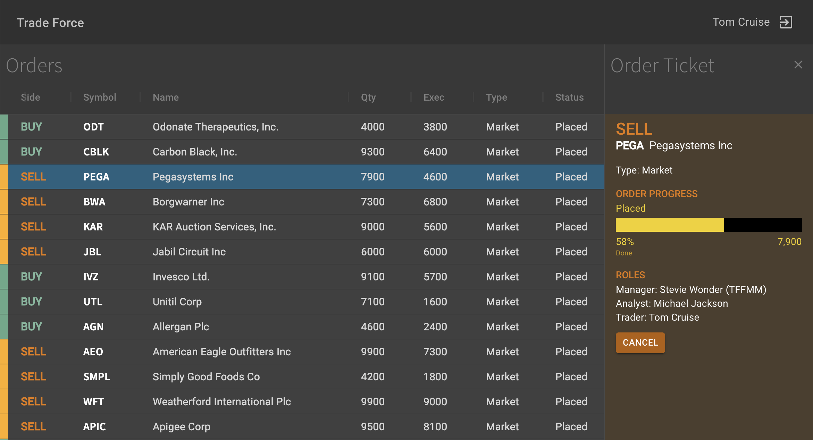

# Trade Force

Trade Force is a sample trading application to demonstrates best practices in
software development such as:

1. [REST maturity level 3 API](https://martinfowler.com/articles/richardsonMaturityModel.html)
2. Rendering a large dataset in [ag-Grid]() using the Server-Side Row Model



# Quick Start

Follow the steps below to see the application running. Detailed explanations are
in respective sub-projects:

```bash
# ----- Shell #1 -----
# Build Trade Force Server
cd trade-force-server
yarn
yarn build

# Start JSON Server
yarn start:json-server


# ----- Shell #2 -----
# Start Trade Force Server
cd trade-force-server
node dist/index.js


# ----- Shell #3 -----
# Start Trade Force Client
cd trade-force-client
yarn
yarn start

# Now point your browser to http://localhost:3000/
# You will see the sign-in screen. Sign in using one of the user IDs listed
on the left.
```
